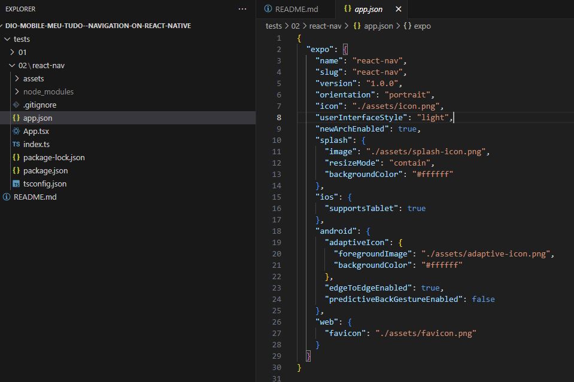
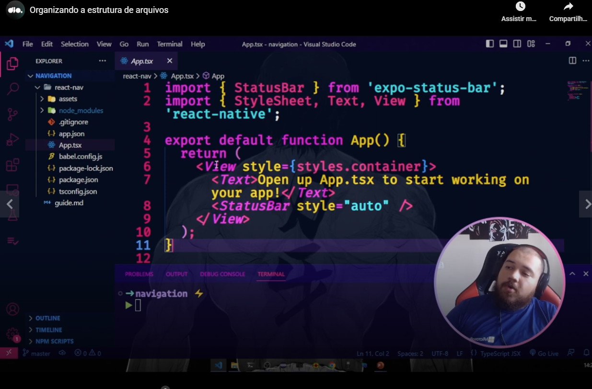
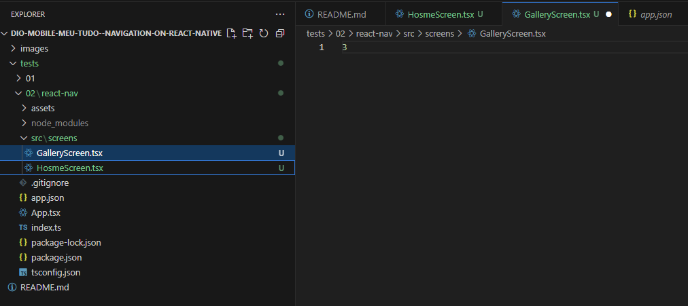
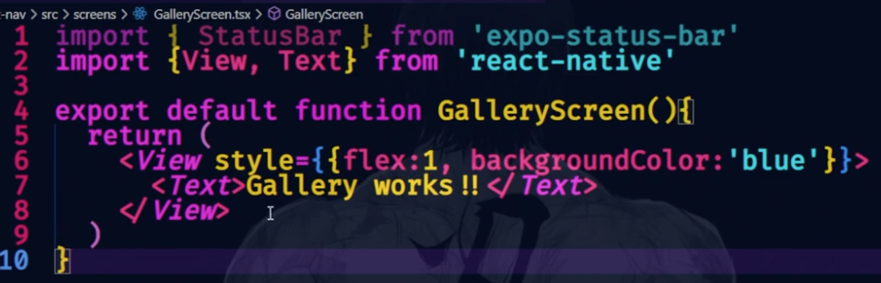
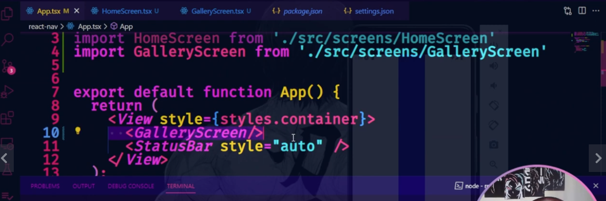
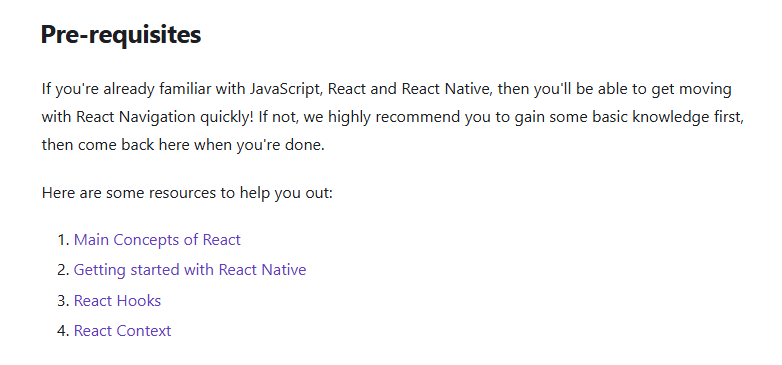
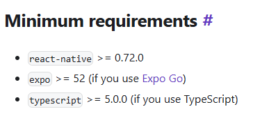
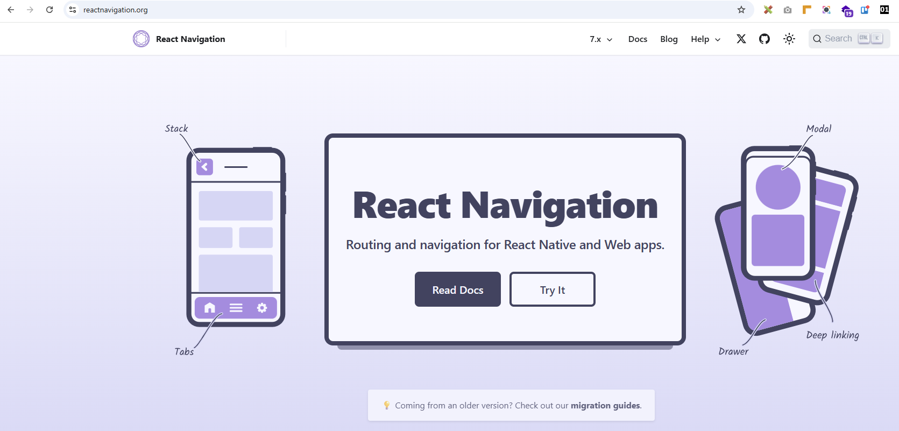

# Introduction

when we use the following command **as example**:

```
expo init react-nav --npm
```

I created a project with the above command selecting the template "Blank (TypeScript)" in the directory tests\02.

I also created a project in tests\01 with the command that I learned before:

```
npx create-expo-app example-app -t
```

I also select a template related to Blank (TypeScript) in this case.

Teacher preferred to create the project with the template blank instead the template navigation (tabs) to create the navigation from scratch, to teach concepts.


# Exploring the app created to make studies

I will talk about the app inside the **tests\02\react-nav** directory.

Remember, I created this project with the following command:

```
expo init react-nav --npm
```


# app.json

- the **app.json** file has **as example** the comfiguration related to the app icons.




# App.tsx

Teacher said the **App.tsx** file is the place where we will put our Lego pieces.




# The use of uppercase in the first letter of the names of components

Teacher instructed us to use the first letter in upper case in components.



Also, teacher said that is a good pratice to create a screens directory and store there files related to screens as I did in a previous image.

Teacher enforced that every screen is also a component.


# Basic screen

Teacher said that this is a skeleton of a basic screen:




# Several screens in the same application

Teacher explained that when we work with the concept of screens, App.tsx will be a heb, selecting a screen and a screen having the content.

Please see the basic content of App.tsx:



The navigation will be done with React Navigation package.


# Documentation

Teacher instructed us to access [the documentation](http://www.reactnavigation.org) of React Navigation.

There obviously you can find as example the install command:

```
npm install @react-navigation/native
```


# Pre-requisites




# Requirements




# External links

Teacher talked about the website [reactnavigation.org](http://www.reactnavigation.org)

There you can see documentation about React Navigation and download a demo app in the "Try It" button.

